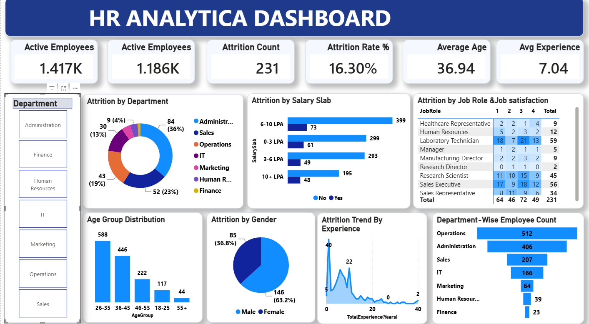

# HR Analytics Dashboard

## 📌 Project Overview
This project is an interactive HR Analytics Dashboard built using Power BI, SQL, and Excel.

## 🛠️ Tools Used
- Power BI
- SQL
- Excel

## 📊 Dashboard Features
- Employee Overview
- Attrition Analysis
- Department-wise Analysis
- Salary Slab Analysis
- Gender Analysis
- Age Group Distribution
- Experience Analysis

## 📷 Dashboard Preview

## 📈 Key Insights
- Attrition Rate: 16.3%
- Active Employees: 1,186
- Total Employees: 1,417
- Average Age: 36.94 Years
